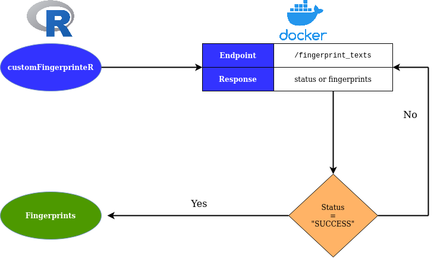

# customFingerprinteR

This R package enables you to easily fingerprint textual data using custom retinas.

## Installation instructions

1. Install the devtools R package on your computer. Follow the instructions given [here](https://www.rdocumentation.org/packages/devtools/versions/1.13.6).
2. Install this library: 

```r
devtools::install_github("FinTxt/customFingerprinteR")
```

## Using the library

The following image schematically shows how this package works together with the custom retina fingerprinter.



There are two important pieces you need:

1. You need to set up a custom fingerprinter API using the instructions in the [docker-fingerprinter](https://github.com/FinTxt/docker-fingerprinter) repository.
2. 

# How?

1. Ensure that the custom docker retina container that you want to use is running.
2. Install this library using ```r devtools::install_github("FinTxt/customFingerprinteR")```
3. Follow the examples below:

First. Check your connection. This will tell you whether or not the server is actually running.

```r
library(sfutils)
library(customFingerprinteR)
# Check connection to host
check_connection()
```

If it is running, it should return 'TRUE'.

Next, check which retinas are available

```r
get_custom_retinas()
```

You can now use the retina to either fingerprint a number of texts, e.g.:

```r
io <- customFingerprinteR::fingerprint_texts(list("A trade war happens when one country retaliates against another by raising import tariffs
                                                    or placing other restrictions on the opposing country's imports.",
                                                  "A tariff is a tax or duty imposed on the goods imported into a nation."), 
                                                  list("text1", "text2"),
                                                  "TenK")
```

Or a single text:

```r
io <- fingerprint_text("A trade war happens when one country retaliates against another by raising import tariffs 
                        or placing other restrictions on the opposing country's imports. A tariff is a tax or duty 
                        imposed on the goods imported into a nation.", 
                      "TenK")
```

Or a single term:

```r
io <- fingerprint_term("trade", "TenK")
```

Note that the objects that are returned are [Document](https://jasperhg90.github.io/sfutils/reference/Document-class.html) and [Term](https://jasperhg90.github.io/sfutils/reference/Term-class.html) classes that have been imported from the [sfutils](https://jasperhg90.github.io/sfutils/) library. 
